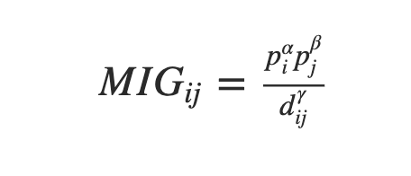
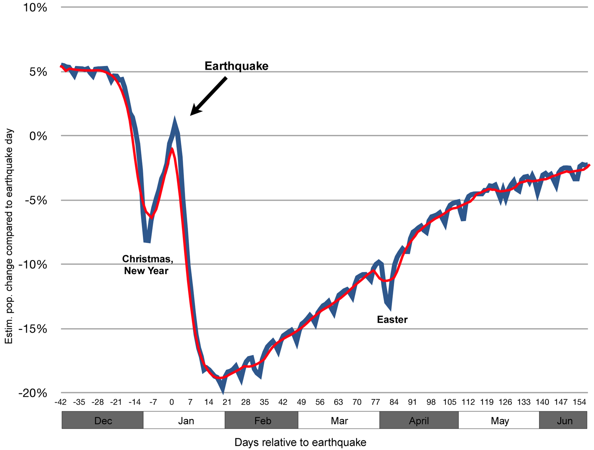

# The use of Gravity-Type Spatial Interaction Models for Improved Disaster Management and Response Throughout Haiti

by Brooke Lamoureux

April 19, 2020

## Introduction

Haiti has suffered from many natural disasters in its history. From earthquakes to diseases and hurricanes, Haiti has been put through the wringer. Over 31,600 Haitians lost their lives or have yet to be found after the monstrous 2010 earthquake. Why is it that low-income countries such as Haiti feel the wrath of natural disasters so harshly? Researchers have reason to believe that calculating death tolls after a disaster has already happened can calculate the number of rescue supplies needed, but does nothing to prevent the amount of damage a natural disaster can do on a low-income country. Studies have found that there are new data science methods that could contribute greatly to the idea of prevention rather than forgiveness. Methods such as analyzing the movement of cell phone SIM cards, social media outlets such as Ushahidi, and remote sensing technology are all machine learning techniques that have proved to detect some sort of algorithm that can aid countries when responding, and trying to defend against natural disasters. While natural disasters are uncontrollable, research has proven that there are modern machine learning techniques that can be analyzed to decrease the death toll, and improve the safety of citizens living in low-income countries. 

The purpose of this research is to advance the use of gravity-type spatial interaction models in low-income countries such as Haiti. By estimating, specifying, and analyzing cell phone SIM card movements and remote sensing technology, researchers and rescuers alike will be able to decrease the mortality rate of Haitians following natural disasters. Though traditional methods worked well for a long period of time, they lacked the ability to prioritize data that flowed in from outside sources, which is crucial being that Haiti is the least developed country in the Western Hemisphere. 

## Inquiry

This research is purely evaluative. It is evaluative because it is seeking to judge the effectiveness of gravity-type spacial interactive models when dealing with disaster relief in Haiti. Variables being evaluated include response time post-earthquake, mortality rates, amount of SIM card data retained, building damage, and the movement of individuals pre- and post-earthquake. 

## Methods
### Method 1: Gravity-Type Spatial Interaction Model

One geospatial data science method that was used after the 2010, 7.0 magnitude earthquake in Haiti was the use of cell phone SIM cards to track the movement of populations after the devastation, also known as a gravity-type spatial interaction model. “We followed daily positions of SIM cards 42 days before the earthquake and 158 days after … We used this ratio to extrapolate from the number of moving SIM cards to the number of moving persons” (Bengtsson, 2011) There are push-pull factors to keep in mind. In this research, the push factor, being the earthquake, and the pull factor, being the promise of unharmed locations are being considered. The data from the SIM cards are taken and plugged into a modern gravity-type algorithm represented by the flux migration of MIGij, and can be shown in figure 1 below. 

 

Where pi and pj refer to the population size at an origin i and a destination j, while dij is the distance between origin i and destination j. Also, the exponents α, β, and γ are unknown and estimated from the data.

Figure 1: SIM card movement over time

Results from SIM card tracking were compared to results gained from the Haitian National Civil Protection Agency and their post-earthquake survey. The HNCPA survey included 2,500 households averaging 4.9 persons. The survey asked questions such as “Did you leave the metropolitan area after January 12 (earthquake day) even if it was for a short time?” and “to what department (province) did you go to?” This survey conducted by the HNCPA is subject to individual interpretation. For comparison, the SIM card tracking method was much more effective and efficient. It produced results within a day. By tracking the movement of people from their original location to their location after the earthquake, rescuers were able to pinpoint exactly where to get supplies, making disaster management and response much faster. The previous use of survey data proved to be less effective than the modern approach of SIM card tracking.

### Method 2: Remote Sensing 

Thi-Thanh-Hiên Pham and colleagues bring to light the use of optical images (15cm of spatial resolution) combined with height data (LiDAR, 1m of spatial resolution) to measure building damage throughout the capital, Port-au-Prince, after the earthquake. The data was organized into three categories of destruction: intact buildings, collapsed buildings, and debris. Through the use of this automatic object-oriented technique, the amount of damage done to each building is measured immediately and proved to be very reliable. The accuracy of classification varied from 70- 79 percent. There were various reasons for error including limited spectral information of the optical images, resolution difference between the two data, high density of buildings but most importantly, certain types of building collapses could not be detected by vertically taken images. The automatic damage mapping strategy discussed in this article could absolutely be used in emergency situations. The entire process took approximately 15 hours, which is much faster than any semi- or fully automatic technique that has been proposed in the past. Semi-automatic techniques are based on visual interpretations of images and are very time and labor-intensive. Automatic damage mapping could be combined with manual visual interpretation to increase and accelerate response times of humanitarian rescues and resources.

## Method Overviews 

Throughout this research process, I have learned many things and have a good idea about what Haiti, among many other low-income countries that should follow suit, should do if they want to improve their quality of life and defense against natural disasters. I have read and analyzed many areas that need to be improved upon including but not limited to infrastructure buildings and traditional post-disaster survey methods. I have also analyzed methods that can be put in place to improve some of these shortfalls for future disaster management including cell phone SIM card movements and remoting sensing technology. Natural disasters such as earthquakes cannot be controlled, but the steps taken after them can be, and it is the world’s job to aid and assist low-income countries such as Haiti when figuring the right methods to put in place for future disasters. 
